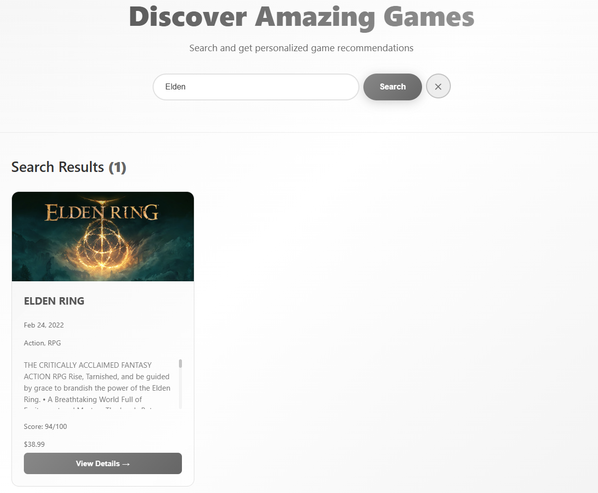
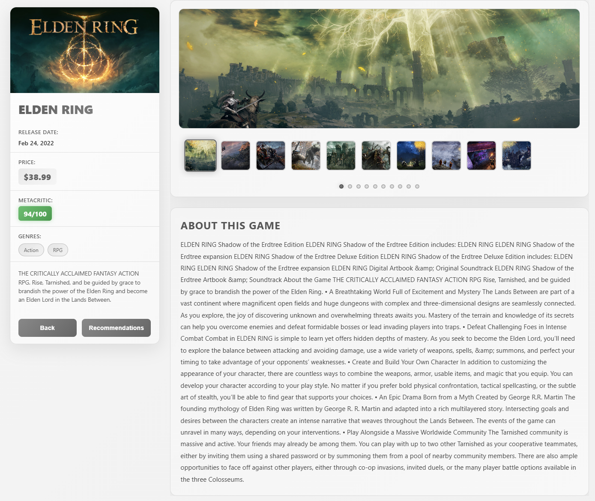
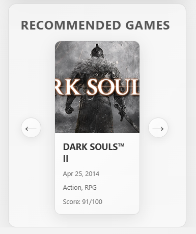

# Game Recommendation System

A full-stack web application that helps you find next game you should play!

## Data Source

This application uses a **SQLite database** populated with comprehensive game data from the **Steam Games Dataset** available on Kaggle
(https://www.kaggle.com/datasets/fronkongames/steam-games-dataset). 
The dataset includes game information such as titles, descriptions, tags, ratings and more.

## Features

- **Game Search**: Search and filter games by title, tags, and characteristics
- **Recommendations**: Get personalized game recommendations based on your interests
- **Game Details**: View detailed information about games including descriptions and tags
- **Responsive UI**: Modern Angular-based interface with smooth browsing experience

## Screenshots

### Application Overview


### Game Details


### Game Recommendations


### Cosine Similarity

The recommendation system uses **Cosine Similarity** to find games similar to a user's selection. Cosine similarity measures the similarity between two games by computing the cosine of the angle between their feature vectors.

## Architecture

### Backend
- **Framework**: ASP.NET Core (.NET 10.0)
- **Database**: SQLite with Entity Framework Core
- **Features**: 
  - RESTful API endpoints for games search and recommendations
  - Game recommendation service with feature caching
  - Data seeding and migrations

### Frontend
- **Framework**: Angular 21
- **Features**:
  - Game card carousel component
  - Game details view with image carousel
  - Search functionality with runtime proxy to backend
  - Responsive design with Nginx reverse proxy

## Getting Started

### Prerequisites
- Docker & Docker Compose
- Alternatively: Node.js 24+, .NET 10.0 SDK

### Running with Docker

```bash
docker-compose up
```

Then open `http://localhost:8080` in your browser. 
(I takes a few seconds for backend to start up)

### Running Locally

**Backend:**
```bash
cd Backend
dotnet run
```
Backend runs at `http://localhost:5236`

**Frontend:**
```bash
cd Frontend
npm install
npm start
```
Frontend runs at `http://localhost:4200`

## API Endpoints

- `GET /api/v1/games/search?title={query}` - Search games
- `GET /api/v1/games/{id}` - Get game details
- `POST /api/v1/recommendations` - Get recommendations

## Author
Sambor Seredyński
